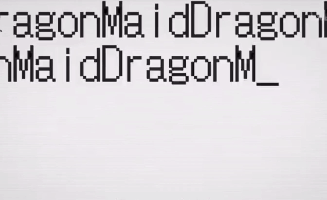

Data Structure and Algorithms - Lintcode Solution in Java
==========================================================

### Ladder - Algorithm 
----
#### 1- Defeat the Algorithm Interview 
| __No.__ |      __Title__      | __Solution__ | __Difficulty__ | 
|:-------:|:--------------------|:------------:|---------------:|
|  627    | Longest Palindrome  |[627](LongestPalindrome.java)| Easy | 

-----
### Ladder - Advanced Algorithm 

#### 5 - Dynamic Problem I 
| __No.__ |      __Title__      | __Solution__ | __Difficulty__ | 
|:-------:|:--------------------|:------------:|---------------:|
|  397    | Longest Continuous Increasing Subsequence |[397](MinimumPathSum.java)| Easy | 
|  110    | Minimum Path Sum    |[110](LongestIncreasingContinuousSubsequence.java)| Easy | 
|  41     | Maximum Subarray.   |[41](MaximumSubarray.java)| Easy | 
|  152    | Decode Ways         |[152](DecodeWays.java)  | Medium | 
|  436    | Maximal Square      |[436](MaximalSquare.java)  | Medium | 
|  200    | Longest Palindromic Substring      |[200](LongestPalindromicSubstring.java)  | Medium | 
|  168    | BurstBalloons       |[168](BurstBalloon.java)| Hard | 

